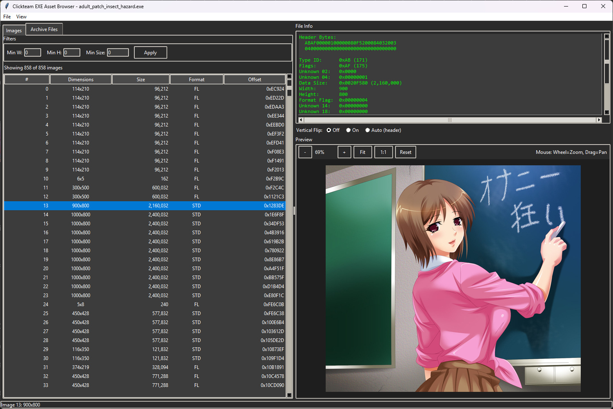

# Insect Hazard Viewer




## 🕵️‍♂️ Overview
**CFAB** is a reverse-engineering tool designed to "break the seal" on games compiled with **Clickteam Fusion**. It bypasses the need for external decompilers by scanning the executable's raw memory footprint to locate, decode, and extract assets.

The tool handles the engine's proprietary **DAT image format** (including Planar Alpha and Chroma Keying) and parses the internal **Stub Archive** to recover embedded files like scripts, DLLs, and music.

---

## ✨ Features

### 🔍 Deep Memory Scanning
* **Heuristic Scan:** Uses memory mapping (`mmap`) to hunt for `zlib` compressed blocks (`0x78` header) and `PAMU` engine signatures.
* **Validation:** Automatically verifies decompressed data against internal header logic to reduce false positives.
* **Caching:** Creates a local `.imgcache` to speed up subsequent loads of large EXEs.

### 🖼️ Advanced Image Viewer
* **Native Decoding:** Renders Clickteam's raw BGR and Planar Alpha formats on the fly.
* **Inspection Tools:**
    * **Zoom/Pan:** High-quality resampling (LANCZOS) for detailed sprite inspection.
    * **Filters:** Filter asset list by Minimum Width, Height, or Data Size.
    * **Header Analysis:** View raw hex data, stride calculations, and flag values.
    * **Transparency:** Checkerboard background for alpha verification.

### 📦 Archive Extraction
* Parses the PE Overlay (Signature `77 77 77 77`) to find the **Stub Archive**.
* View and extract embedded file systems including:
    * `*.mfx` / `*.ift` (Extensions)
    * `*.dll` (Dependencies)
    * `*.ccn` (Game Data)

### 💾 Export Capabilities
* **Batch Export:** Dump all assets to PNG or Raw DAT in one click.
* **Format Conversion:** Automatically converts raw BGR/Alpha planes to standard RGBA PNGs.
* **Raw Dump:** Export untouched `.dat` files for hex editing or debugging.

---

## 🎮 Controls

The GUI is optimized for rapid inspection of thousands of assets.

| Input | Action |
| :--- | :--- |
| **Mouse Wheel** | Zoom In / Out |
| **Left Click + Drag** | Pan Image |
| **Double Click** | Fit Image to Window |
| **`+` / `=`** | Zoom In |
| **`-`** | Zoom Out |
| **`0`** | Reset View (100% Center) |
| **`F`** | Fit to Window |

---

## 🛠️ Installation & Usage

### Requirements
The tool relies on standard Python libraries plus `Pillow` for image rendering.

```bash
pip install Pillow
